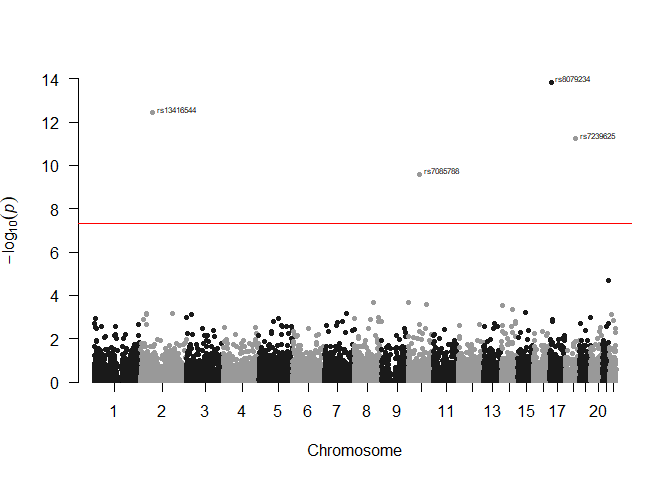

Manhattan plot
================
Li-Hsin Chien
2025-04-11

使用 package: *qqman*

指令 *manhattan* 需要輸入的資料包含:

- chr: 染色體編號
- bp: 染色體上的位置 (basepair)
- snp: SNP id
- p: GWAS p-value

以上這些， plink 指令 –linear 產生的 output 都有。

讀入範例檔案: *Manhattan_test.assoc2.linear*:

``` r
r<-read.table(file="Manhattan_test2.assoc.linear",header=T)
head(r,12)
```

    ##    CHR        SNP     BP A1 TEST NMISS     BETA     STAT         P
    ## 1    1   rs940550  88169  T  ADD  1092   0.2598   1.1830 2.370e-01
    ## 2    1   rs940550  88169  T  sex  1092   4.8150  18.8100 1.498e-68
    ## 3    1   rs940550  88169  T  pc1  1092 -45.3900 -10.6000 4.899e-25
    ## 4    1   rs940550  88169  T  pc2  1092   0.8538   0.1952 8.453e-01
    ## 5    1   rs940550  88169  T  pc3  1092  -1.4800  -0.3483 7.277e-01
    ## 6    1 rs12184306  98929  G  ADD  1092   0.3967   1.4000 1.619e-01
    ## 7    1 rs12184306  98929  G  sex  1092   4.7850  18.7100 6.355e-68
    ## 8    1 rs12184306  98929  G  pc1  1092 -45.7000 -10.7900 7.733e-26
    ## 9    1 rs12184306  98929  G  pc2  1092   1.3940   0.3273 7.435e-01
    ## 10   1 rs12184306  98929  G  pc3  1092  -0.8736  -0.2070 8.360e-01
    ## 11   1  rs2980291 796511  G  ADD  1092  -0.1971  -0.4938 6.216e-01
    ## 12   1  rs2980291 796511  G  sex  1092   4.7960  18.7500 3.727e-68

``` r
m<-dim(r)[1]/5 # SNP 個數
r.snp<-r[5*(1:m)-4,]

manhattan(r.snp,chr="CHR",bp="BP",snp="SNP",p="P",suggestiveline=F,annotatePval = 5*10^-8)
```

<!-- -->

PS: 這個範例由於要縮小檔案大小的關係，有刪減 SNPs。你們跑的時候因為 SNPs
個數多非常多，出圖的時間可能會比較久。

Reference: <https://r-graph-gallery.com/101_Manhattan_plot.html>
